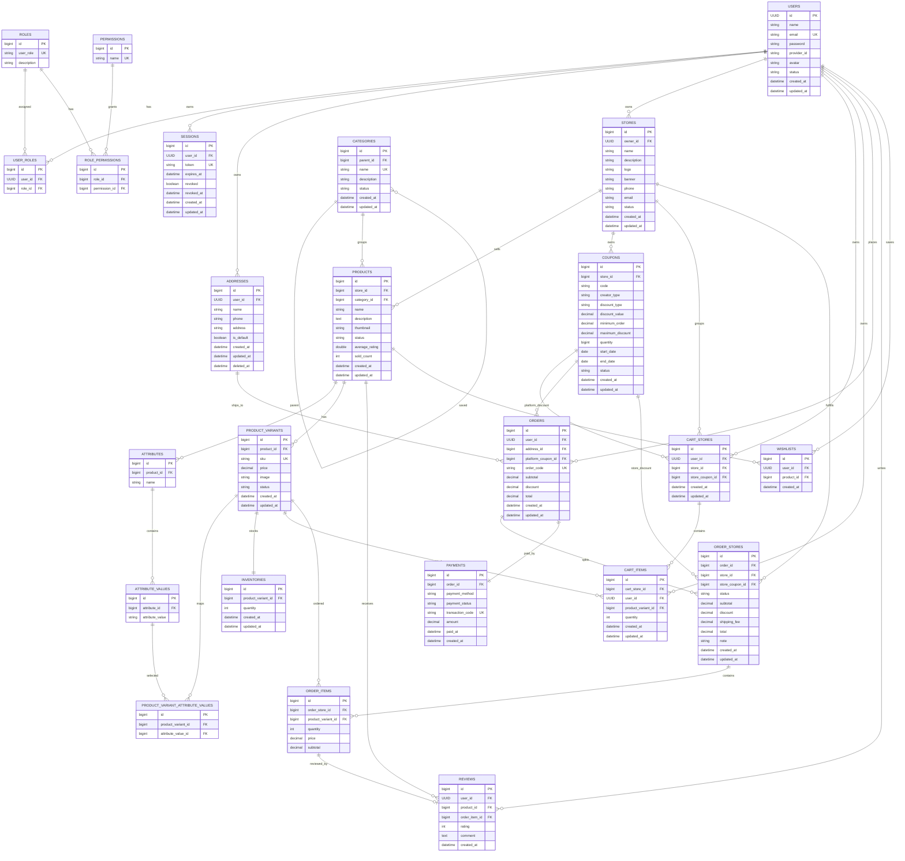

# E-Commerce Backend

Spring Boot backend for a multi-store e-commerce platform. The project includes authentication, RBAC, store management, product catalog, inventory, cart, checkout, order management, reviews, coupons, wishlist, file uploads, and bank-transfer payment confirmation through a SePay webhook flow.

## Tech Stack

- Java 17
- Spring Boot 4.1.0
- Spring Web MVC
- Spring Security + JWT
- OAuth2 login with Google
- Spring Data JPA + Hibernate
- MySQL 8
- Redis
- MapStruct
- Lombok
- Cloudinary
- JUnit 5 + Mockito
- Docker Compose

## Main Features

- Authentication with email/password, Google OAuth2, JWT access tokens, and refresh sessions.
- RBAC with roles, permissions, and role-permission mappings.
- Store lifecycle management for sellers.
- Product catalog with categories, variants, attributes, inventory, and image upload.
- Cart grouped by store, with cart item quantity updates and cleanup.
- Checkout flow that creates orders from selected cart items.
- Coupon validation for platform and store coupons.
- Order store status management.
- Review creation only for delivered order items.
- Payment records created only after a successful paid confirmation.
- SePay webhook endpoint for bank transfer confirmation.

## Payment Flow

Orders and payments are intentionally separate.

1. A customer creates an order.
2. The system returns the order code and total amount.
3. The customer transfers money using the order code in the transfer content.
4. SePay sends a webhook to the backend.
5. The backend extracts the order code, verifies the order and paid amount, then creates a `Payment` record with status `PAID`.

`OrderService.create()` does not create a payment record. Payment creation happens after payment confirmation through `PaymentService`.

Webhook endpoint:

```http
POST /webhooks/sepay
```

## Project Structure

```text
src/main/java/com/example/e_commerce
+-- config          Application and security configuration
+-- constant        Enums for roles, statuses, payment methods, etc.
+-- controller      REST API controllers
+-- dto             Request and response DTOs
+-- entity          JPA entities
+-- exception       Custom exceptions and global exception handling
+-- filter          JWT request filter
+-- handler         OAuth2 success handler
+-- mapper          MapStruct and manual mappers
+-- repository      Spring Data repositories
+-- service         Business logic
`-- utils           Utility classes
```

## Database Schema



## Environment Variables

Create a `.env` file or export these variables in your environment:

```env
DB_URL=jdbc:mysql://localhost:3308/e_sql
DB_USERNAME=root
DB_PASSWORD=your_database_password

JWT_SECRET=your_32_byte_or_longer_secret

GOOGLE_CLIENT=your_google_client_id
GOOGLE_SECRET=your_google_client_secret
REDIRECT_URI={baseUrl}/login/oauth2/code/{registrationId}

CLOUD_NAME=your_cloudinary_cloud_name
API_KEY=your_cloudinary_api_key
API_SECRET=your_cloudinary_api_secret

REDIS_HOST=localhost
REDIS_PORT=6379
REDIS_PASSWORD=

EMAIL_PORT=587
EMAIL_USERNAME=your_email
EMAIL_PASSWORD=your_app_password
```

Do not commit real credentials to source control.

## Run Locally

Start MySQL with Docker Compose:

```powershell
docker compose up -d e-sql
```

Run the application:

```powershell
.\mvnw.cmd spring-boot:run
```

Or with local Maven:

```powershell
mvn spring-boot:run
```

The application runs on:

```text
http://localhost:8080
```

Health check:

```http
GET /actuator/health
```

## Run With Docker Compose

```powershell
docker compose up --build
```

This starts MySQL and the backend application.

## Testing

Run all unit/service tests:

```powershell
mvn "-Dtest=*ServiceTest" test
```

Run a specific test class:

```powershell
mvn "-Dtest=PaymentServiceTest" test
```

Run the full test suite:

```powershell
mvn test
```

The test profile uses H2 in-memory database for the Spring context test.

## Important API Areas

- `POST /auth/register`
- `POST /auth/login`
- `POST /orders`
- `GET /orders/me`
- `GET /orders/me/{id}`
- `POST /reviews`
- `GET /reviews/products/{productId}`
- `DELETE /reviews/{id}`
- `POST /webhooks/sepay`

Some endpoints require JWT authentication. The SePay webhook endpoint is publicly accessible because it is called by an external payment service.

## Notes

- Database schema is managed by Hibernate with `spring.jpa.hibernate.ddl-auto=update` in the default profile.
- RBAC seed data is initialized by `DataInitializer`.
- Cloudinary is used for product and store image uploads.
- Redis is configured for application infrastructure support.
- The current payment implementation supports confirmed bank transfers and stores successful transactions as `Payment` rows.
